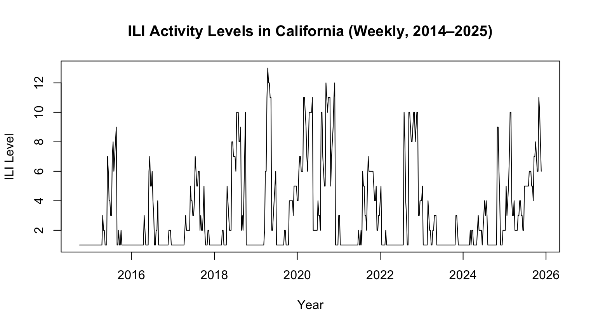
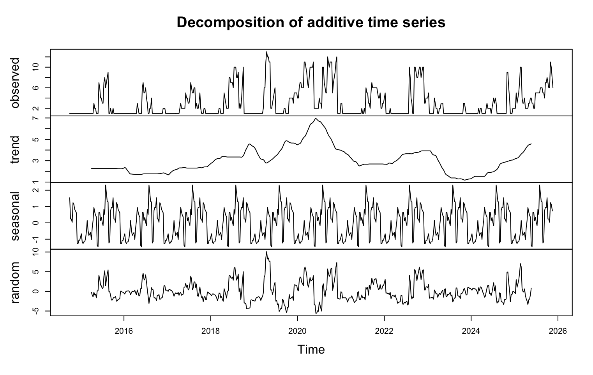
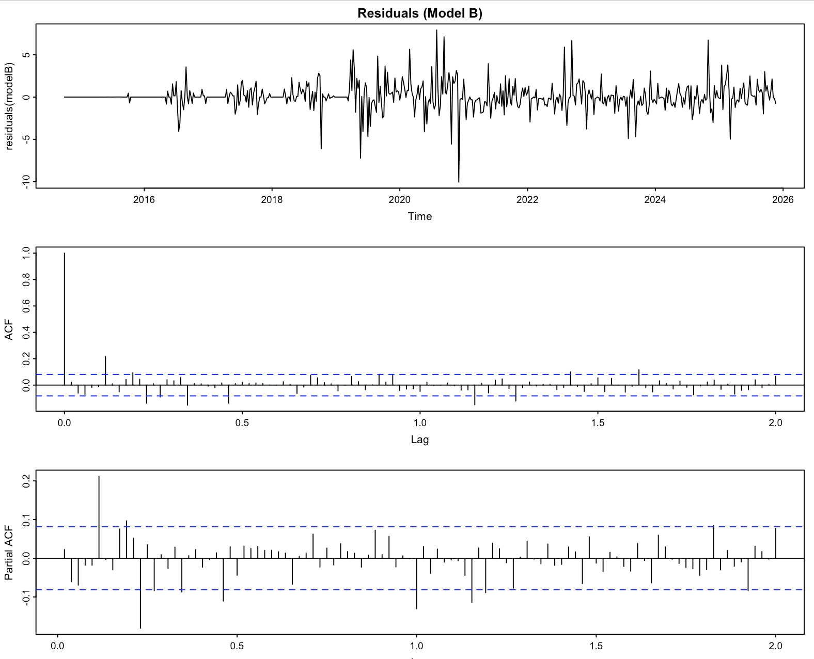
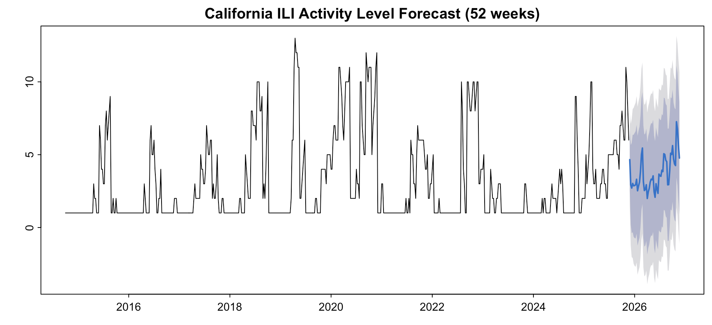

# SARIMA Forecasting of California ILI Activity
 
**Tools:** R | ARIMA/SARIMA | CDC ILINet Data  

---

## Overview

This project develops a seasonal time series forecasting model to predict weekly **Influenza-Like Illness (ILI) activity levels** in California using CDC ILINet surveillance data spanning October 2014 through November 2025.

Three SARIMA model candidates were evaluated and compared using AIC, residual diagnostics, and forecasting accuracy. The winning model — **SARIMA(1,0,0)×(1,1,1)[52]** — was used to generate a 52-week forecast for the 2025–2026 ILI season.

---

## Dataset

- **Source:** [CDC FluView — ILINet State Activity Indicator](https://gis.cdc.gov/grasp/fluview/fluportaldashboard.html)
- **Scope:** Weekly ILI activity levels for California, 2014–2025
- **Raw size:** 31,607 rows × 8 columns (all U.S. states)
- **Target variable:** `ACTIVITY LEVEL` — a standardized weekly classification from Level 1 (minimal) to Level 13 (very high)

---

## Methodology

### 1. Data Preprocessing
- Filtered dataset to California observations only
- Converted `WEEKEND` date strings (e.g., `"Apr-01-2017"`) to proper R date format
- Transformed `ACTIVITY LEVEL` text labels (e.g., `"Level 5"`) into numeric integers
- Verified no missing weeks using consecutive date differencing

### 2. Exploratory Analysis

The weekly time series reveals clear annual seasonality — sharp winter spikes and near-zero summer lows — alongside a notable COVID-19 disruption in 2020–2021 and an elevated baseline in 2024–2025.



### 3. Seasonal Decomposition

Additive decomposition was applied to isolate the trend, seasonal, and random components of the series. The trend panel captures the COVID-19 surge and the recent 2024–2025 upward drift. The seasonal component is strong, stable, and repeating annually.



### 4. Stationarity Testing
- Plotted ACF and PACF at standard and extended lag windows (up to lag 104)
- Ran **Augmented Dickey-Fuller (ADF)** and **KPSS** tests
- Results indicated stationarity without non-seasonal differencing; seasonal differencing (period = 52) was applied

### 5. Model Fitting & Selection

Three candidate models were tested:

| Model | Specification | AIC |
|-------|--------------|-----|
| A | SARIMA(0,0,0)×(1,1,1)[52] | — |
| B | **SARIMA(1,0,0)×(1,1,1)[52]** | **2065.77** ✅ |
| C | SARIMA(0,0,1)×(1,1,1)[52] | — |

**Model B** outperformed the others by several hundred AIC points. Key coefficients:
- `ar1 = 0.8402` — strong week-to-week autocorrelation in ILI activity
- `sar1` — modest influence from the same week in the prior year

### 6. Residual Diagnostics

Residual plots confirm Model B successfully removed seasonal and autoregressive structure from the data. The ACF of residuals drops immediately to zero, and the residual time plot shows no drift or lingering pattern.



### 7. Forecasting

A 52-week forecast for the 2025–2026 ILI season captures the expected winter surge and summer decline. The forecast predicts an elevated baseline (levels 3–7) consistent with the upward trend observed in 2024–2025. Prediction intervals widen appropriately over time.



---

## Key Findings

- Strong, consistent **annual seasonality** confirmed in California ILI data
- **SARIMA(1,0,0)×(1,1,1)[52]** was the best-fitting model with an AIC of 2065.77
- The `ar1` coefficient (0.8402) indicates strong week-to-week autocorrelation in ILI activity
- The 52-week forecast suggests ILI levels for 2025–2026 may remain **above historical averages**, consistent with recent trends
- The model successfully captured the COVID-19 disruption period and the return to seasonal norms after 2021

---

## Limitations

- **Univariate model** — only uses past ILI activity levels; does not account for vaccination rates, temperature, population shifts, or other external variables
- Ljung-Box test results may be inflated due to large sample size (580 observations); residual plots were prioritized
- Forecasts should be interpreted alongside real-time surveillance data, not as standalone predictions

---

## R Packages Used

| Package | Purpose |
|---------|---------|
| `readr` | CSV import |
| `dplyr` | Data preprocessing and filtering |
| `tseries` | ADF and KPSS stationarity tests |
| `forecast` | ARIMA/SARIMA modeling and forecasting |
| Base R `stats` | `ts()`, `decompose()`, `arima()`, `acf()`, `pacf()` |

---

## Files

```
├── 5140_Final_Project.R              # Full R analysis script
├── 5140_Final_Project_Write_Up.docx  # Full written project report
├── images/
│   ├── ili_time_series.png           # Weekly ILI activity plot (2014–2025)
│   ├── decomposition.png             # Additive decomposition
│   ├── residual_diagnostics.png      # Model B residuals, ACF, PACF
│   └── forecast_52weeks.png          # 52-week SARIMA forecast
└── README.md
```

---

## References

- Centers for Disease Control and Prevention. (2024). *ILINet weekly activity indicators, 2014–2025*. https://gis.cdc.gov/grasp/fluview/fluportaldashboard.html  
- Hyndman, R. J., & Athanasopoulos, G. (2021). *Forecasting: Principles and practice* (3rd ed.). https://otexts.com/fpp3/  
- R Core Team. (2024). *R: A language and environment for statistical computing*. https://www.r-project.org/
